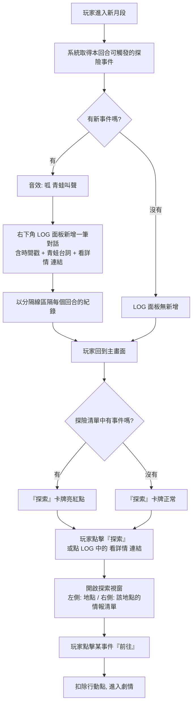

# 養成系統情報網 UI/UX 設計範例：童淵事件線

本文件以「童淵」的連鎖事件為例，展示在「主動跳出（側邊欄）」與「靈犀情報簿」系統下，玩家在養成模式中會經歷的具體 UI 流程與文本呈現。

---

## 核心機制回顧

1.  **情報推播（主動跳出）：** 僅在有「新情報」或「緊急情報」的回合開始時，於畫面側邊滑出輕量級提示，不強制打斷玩家操作。
2.  **靈犀情報簿（詳細介面）：** 玩家點擊推播或常駐圖示後打開的完整介面，可查看詳情並進行「快捷傳送」。
3.  **行動點數 (AP)：** 執行情報事件通常會消耗對應的 AP（例如 5 點或 9 點）。

---

## 事件一：初遇與切磋

*   **觸發條件：** 179年3月下旬，玩家首次進入養成模式。
*   **事件類型：** 新情報（主動跳出）

### 核心 UI 流程圖



### LOG 面板視覺範例

```
┌──────────────────────────────┐
│  靈犀情報簿                  │
├──────────────────────────────┤
│  ── 179年6月下旬 ──          │
│  浪裡白條:                   │
│  「村口耍長槍的怪人今日       │
│   頻頻嘆氣，似有心事。」      │
│                  [看詳情 →]  │
├──────────────────────────────┤
│  ── 179年6月上旬 ──          │
│  鼓上蚤:                     │
│  「客棧後院夜有黑影。」       │
│                  [看詳情 →]  │
└──────────────────────────────┘
```

> **設計要點：**
> *   **時間戳分隔：** 每個回合的紀錄以橫線分隔，方便玩家回顧不同月份的情報。
> *   **超連結跳轉：** 點擊「看詳情」直接開啟探索視窗並跳到對應事件，省去玩家自己找地點的麻煩。
> *   **保留歷史紀錄：** LOG 不會清空，玩家隨時可以往上滾動翻閱過去的青蛙密報。

### 1. 回合開始 (UI 推播)

玩家點擊「前往下個月段」，進入 179年3月下旬。畫面亮起後：

*   **[音效]** 輕快的竹簡展開聲。
*   **[UI 演出]** 畫面右側滑出一個狹長的「竹簡」面板。
*   **[面板內容]**
    *   **頭像：** 蕭靈犀 (表情：好奇)
    *   **文字泡泡：** 「表哥，村口空地來了個耍長槍的怪人，青蛙幫說他武功好像很高耶！」
    *   **情報標題：** `[浪裡白條 報] 村口的持槍遊俠`
    *   **按鈕：** `[查看詳情]`

*(此時玩家可以不理會面板，直接去點擊下方的「鍛鍊」卡牌。面板會在玩家執行其他動作後自動縮回，變成右上角帶紅點的「信箋」圖示。)*

### 2. 玩家點擊 `[查看詳情]` 或 `[常駐情報圖示]` (打開情報簿)

畫面中央的 3D 房間變暗，彈出【靈犀情報簿】大視窗。這個視窗整合了你原有的「探索」UI，分為兩個分頁：

**【分頁一：靈犀情報】 (預設開啟)**
*   **[左側列表]** (顯示所有未處理的情報，包含新舊)
    *   🔴 `[新] 童淵的煩惱 (消耗 5 點)` <- (玩家點擊選中此條目)
    *   🔴 `[新] 客棧夜影 (消耗 9 點)`
    *   🔴 `[新] 迷霧怪聲 (消耗 5 點)`
    *   ⚪ `[舊] 尋找龜涎石 (消耗 5 點)`
*   **[右側詳情]** (根據左側選中的條目，動態切換內容)
    *   **圖片：** (切換為童淵相關圖片)
    *   **靈犀筆記：** 「浪裡白條說，那個人在那邊練槍好半天了，看起來很厲害。表哥你不是一直想找人切磋嗎？要不要去會會他？」
    *   **按鈕：** `[立刻前往 (消耗 5 點)]`

**【分頁二：區域探索】 (保留你原本的 UI)**
*   **[左側列表]** 顯示「城鎮」、「森林」等區域圖示。
*   **[右側詳情]** 顯示區域預覽圖，以及「消耗 5 點行動點進行隨機探索」的說明。
*   **按鈕：** `[開始探索]`

### 3. 執行事件

玩家點擊 `[立刻前往]`。
*   **[UI 演出]** 情報簿關閉，畫面黑屏水墨轉場。
*   **[劇情觸發]** 直接跳轉至文本：`旁白：＊（你們路過村中的一片空地，只見一名身材挺拔的年輕遊俠正在專注地練習槍法...）＊`
*   *(完成切磋劇情後，扣除 5 點 AP，回到養成主畫面。)*

---

## 事件二：槍桿之材 (連鎖事件 A)

*   **觸發條件：** 179年4月上旬（完成初遇事件後的下一回合）。
*   **事件類型：** 新情報（主動跳出）

### 1. 回合開始 (UI 推播)

進入 179年4月上旬。

*   **[後台邏輯]** 系統判定此回合有 3 個新事件觸發。
*   **[音效]** 輕快的鈴鐺聲或鳥鳴聲（代表靈犀的提醒）。
*   **[UI 演出]** 在畫面**右下方**（指令列的右側，任務追蹤的下方），浮現一個【靈犀情報】的對話框面板。
    *   *設計考量：利用右下角的空間，既能引起注意，又不會遮擋中央的 3D 房間和下方的指令列。*
*   **[面板內容]**
    *   這是一個垂直排列的對話紀錄面板。
    *   **內容排版：**
        *   **(圖示：浪裡白條)** 「村口耍長槍的怪人今日頻頻嘆氣，似有心事。」
        *   **(圖示：鼓上蚤)** 「客棧後院夜有黑影，恐有蹊蹺。」
        *   **(圖示：阮小七)** 「迷霧森林異響頻傳，請少俠定奪。」
        *   **(頭像：蕭靈犀)** 「表哥，今日江湖甚是熱鬧，咱們先去哪一處？」
*   **[玩家互動]**
    *   這個面板主要作為**資訊展示**。
    *   玩家看完後，可以點擊面板右上角的 `[X]` 關閉，或者點擊畫面其他空白處，面板就會自動收起（或淡出）。
    *   玩家接著可以自由點擊下方的指令卡牌（如打坐、練功、探索）。

### 2. 玩家選擇常規指令或點擊【探索】

*   當回合有未處理的情報時，下方的 `[探索]` 指令卡牌上會亮起紅點。

**【區域探索與情報整合】**
當玩家點擊 `[探索 🔴]` 打開探索介面時：
*   **[左側列表]** (顯示區域圖示，並帶有未讀紅點)
    *   🔴 `[城鎮]` <- (因為童淵和一枝花的事件都在城鎮，所以有紅點)
    *   🔴 `[森林]` <- (因為有迷霧怪聲事件，所以有紅點)
    *   ⚪ `[後山]` <- (沒有事件，無紅點)
*   **[右側詳情]** (當玩家點擊左側的 🔴 `[城鎮]` 時)
    *   **區域預覽圖：** 城鎮街道。
    *   **情報清單：** (原本顯示「消耗行動點8點」的地方，改為列出該區域當前的所有事件)
        *   `[鼓上蚤 報] 童淵的煩惱 (消耗 5 點)` `[前往]`
        *   `[浪裡白條 報] 客棧夜影 (消耗 9 點)` `[前往]`
    *   **一般探索：** (在情報清單下方，保留原本的隨機探索按鈕)
        *   `[消耗 8 點進行隨機探索]` `[開始]`

**【區域探索與情報整合】**
*   **[左側列表]** (顯示區域圖示，並帶有未讀紅點)
    *   🔴 `[城鎮]` <- (因為童淵和一枝花的事件都在城鎮，所以有紅點)
    *   🔴 `[森林]` <- (因為有迷霧怪聲事件，所以有紅點)
    *   ⚪ `[後山]` <- (沒有事件，無紅點)
*   **[右側詳情]** (當玩家點擊左側的 🔴 `[城鎮]` 時)
    *   **區域預覽圖：** 城鎮街道。
    *   **情報清單：** (列出該區域當前的所有事件)
        *   `[鼓上蚤 報] 童淵的煩惱 (消耗 5 點)` `[前往]`
        *   `[浪裡白條 報] 客棧夜影 (消耗 9 點)` `[前往]`
    *   **一般探索：** `[消耗 5 點進行隨機探索]`

### 3. 執行事件

玩家點擊 `[立刻前往]`。
*   **[劇情觸發]** 跳轉至文本：`旁白：＊（你再次來到村中空地，卻見童淵並未練槍，而是一臉苦惱地撫摸著他的槍桿...）＊`
*   *(玩家接取尋找「百年鐵木」的任務。)*

---

## 事件三：交付鐵木與傳授武功 (連鎖事件 B)

*   **觸發條件：** 玩家在「出外探險（森林）」中取得了「百年鐵木」，進入下一個養成回合時。
*   **事件類型：** 任務完成回報（主動跳出）

### 1. 回合開始 (UI 推播)

*   **[音效]** 愉悅的提示音（與一般情報不同）。
*   **[UI 演出]** 畫面右側滑出竹簡面板。
*   **[面板內容]**
    *   **頭像：** 蕭靈犀 (表情：開心)
    *   **文字泡泡：** 「表哥！我們找到鐵木了，快拿去給童大哥看看吧！」
    *   **情報標題：** `[任務回報] 修復長槍的希望`
    *   **按鈕：** `[查看詳情]`

### 2. 玩家點擊 `[查看詳情]`

彈出【靈犀情報簿】。

*   **[左側列表]**
    *   `[任務回報] 修復長槍的希望 (不消耗點數)` <- (因為是回報任務，可設定為不扣 AP)
*   **[右側詳情]**
    *   **圖片：** 百年鐵木的道具圖示 + 童淵的頭像。
    *   **靈犀筆記：** 「千辛萬苦總算找到了！童大哥一定會很高興的，說不定還會教你幾招厲害的槍法呢！」
    *   **按鈕：** `[立刻前往]`

### 3. 執行事件

玩家點擊 `[立刻前往]`。
*   **[劇情觸發]** 跳轉至文本：`旁白：＊（你帶著辛苦尋來的百年鐵木，再次來到村中空地...）＊`
*   *(童淵傳授「百鳥朝鳳」槍法，隨後離開小溪村。)*

---

## 總結：此流程的設計優勢

1.  **強烈的連鎖反饋：** 玩家剛打到「百年鐵木」，下一回合靈犀立刻跳出來提醒「快去交任務」。這讓玩家感受到世界是動態響應他們行為的。
2.  **免除跑圖煩惱：** 玩家不需要記住「童淵在哪個地圖的哪個角落」，只要點擊情報簿的 `[立刻前往]`，系統自動處理尋路與場景切換。
3.  **靈犀的存在感極大化：** 所有的事件引導都透過蕭靈犀的口吻說出，她不再只是個跟班，而是真正掌管主角行程的「經紀人/情報官」。